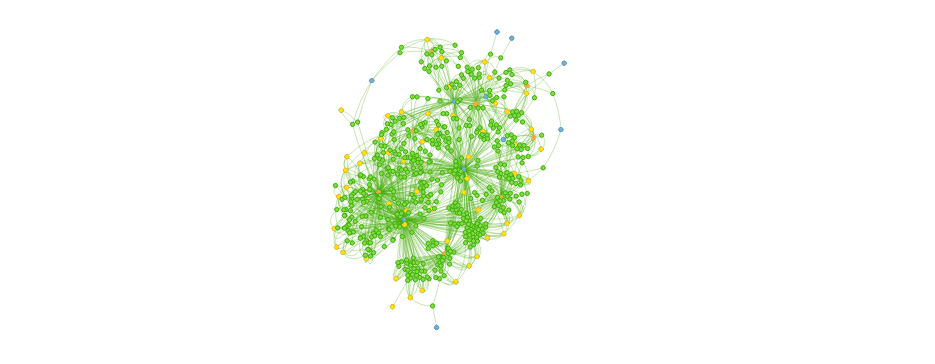
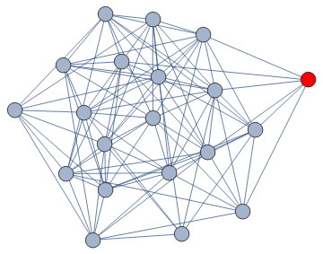
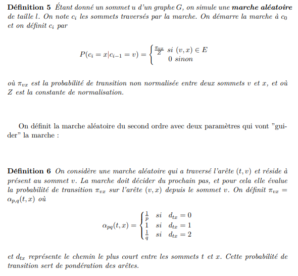

<center>

</center>

**<font color="green">[A quick reminder regarding the final objectives]</font>**

This paper brings to light how **network embedding graphs** can help to solve major open problems in natural language understanding. One illustrative element in NLP could be **language variability** - or **ambiguity problem** - which happens when two sentences express the same meaning (or ideas) with very different words. For instance we may say almost interchangeably: *<font color="blue">"where is the nearest sushi restaurant?"</font>* or *<font color="blue">"can you please give me addresses of sushi places nearby?"</font>*. These two sentences exactly share the same meaning with a different semantic wording. Here is the big challenge that we are struggling. In terms of data science, it bears witness of a well-known problem called **text similarity**. Indeed, my sparse vectors for the 2 sentences have no common words and consequently will have a cosine distance of 1. This is a terrible distance score because the 2 sentences have very similar meanings. 

The first thing that is crossing any data scientists'mind would have been to use popular **document embedding methods** based on **similarity measures** such as **Doc2Vec**, **Average w2v vectors**, **Weighted average w2v vectors** (e.g. tf-idf), **RNN-based embeddings (e.g. deep LSTM networks)**, ... to cope with this text similarity challenge. 

As for us, we will tackle this text similarity challenge by implementing **network graph embeddings** in light of **traditional word embeddings technics**. 

**<font color="green">[In this part]</font>**

This part aims at implementing a neo4j graph database. We currently have two pieces of information: 

- We have news - written in English according many topics. This is a **text** format. Here is the <font color="blue">micro level</font>. To carry out our final objective, this is the most valuable piece of information. 

- In addition, we have information regarding the context of news - when they are published, where they come from, from which category they fall down, who write them, ... Here is a <font color="blue">macro level</font>. 

The objectives is to play with these two levels in order to classify news at best.

# Micro Level

In network science, there’s a useful tool called **a random walk**. It is a simulation of traffic on a network, where **tiny “agents”** move from node to node according to **some probabilities set in the network**. Borrowing from a passage on the Wikipedia article,

“…one can imagine a person walking randomly around a city. The city is effectively infinite and arranged in a square grid of sidewalks. At every intersection, the person randomly chooses one of the four possible routes (including the one originally traveled from)… Will the person ever get back to the original starting point of the walk?”

<center>

</center>

node2vec learns representations of nodes in a graph through the application of the word2vec model on sequences of nodes sampled through random walks. The innovation brought by node2vec is the definition of a random walk exploration that is flexible and adaptable to the diversity of connectivity patterns that a network may present.

In order to generate our corpus from the input graph, let’s think about a corpus as a group of directed acyclic graphs, with a maximum out degree of 1. If we think about it this is a perfect representation for a text sentence, where each word in the sentence is a node and it points on the next word in the sentence.

Le **representation learning** est une méthode de représentation de données destinées à un modèle d’apprentissage, qui sont elles même paramétrées par un modèle.

Une méthode de représentation a permis une augmentation considérable de la précision des modèles sur le traitement du langage, grâce à skip-Gram. Le principe de cette représentation repose sur une réduction de l’espace de données par une représentation locale du voisinage des mots du corpus.

<center>

</center>

Sur ce même principe, node2vec a pour objectif de créer une représentation du graphe dans un espace de faible dimension. Il effectue une représentation locale du voisinage des sommets d’un graphe, et représente donc chaque sommet de ce graphe par un vecteur de voisinage. L’approche mise en évidence par Skip-Gram dans le domaine du traitement du langage utilise une représentation du voisinage statique. L’apport de node2vec réside dans l’utilisation d’un modèle d’apprentissage pour définir la stratégie de représentation de voisinage d’un sommet. node2vec utilise pour cela une marche aléatoire du second ordre.

<center>

</center>

http://www.lirmm.fr/~bourreau/SOURCES/lapprentissage-statistique-Antonin-Barthelemy.pdf


# Load Packages

```{python, echo=FALSE}
import warnings
from text_unidecode import unidecode
from collections import deque
warnings.filterwarnings('ignore')


import pandas as pd
from sklearn.manifold import TSNE
import numpy as np
import networkx as nx
import matplotlib.pyplot as plt
import matplotlib.patches as mpatches
import seaborn as sns
from node2vec import Node2Vec
from gensim.models import Word2Vec

import re
import nltk
from nltk.corpus import stopwords
from nltk.stem.porter import *
stemmer = PorterStemmer()

import os

import networkx as nx
import numpy as np
import matplotlib.pyplot as plt

import matplotlib

import time
from concurrent.futures import ThreadPoolExecutor
from time import sleep
```

# Pre-processing text

## Loading text

```{python}
path="C:/Users/adsieg/Desktop/node2vec"
os.chdir(path)

news = pd.read_csv('news.csv')
text_total = news.description 
text_total = text_total.reset_index(drop=True)
```

```{python}
print(text_total.head())
```

## Cleaning text

```{python}
# function to clean text
def review_to_words(raw_review):
    
    # 1. Remove non-letters        
    letters_only = re.sub("[^a-zA-Z]", " ", raw_review) 
    
    # 2. Convert to lower case, split into individual words
    words = letters_only.lower().split()
    
    # 3. Remove Stopwords. In Python, searching a set is much faster than searching a list, so convert the stop words to a set
    stops = set(stopwords.words("english"))                  
    
    # 4. Remove stop words
    meaningful_words = [w for w in words if not w in stops]  #returns a list 

    # 5. Stem words. Need to define porter stemmer above
    singles = [stemmer.stem(word) for word in meaningful_words]
    
    # 7. remove remaining tokens that are not alphabetic
    singles = [word for word in singles if word.isalpha()]
    
    # 8. Join the words back into one string separated by space, and return the result.
    return( " ".join( singles ))
```


```{python}
# apply it to our text data 
# dataset is named wine_data and the text are in the column "wmn"
processed_wmn = [ review_to_words(str(text)) for text in text_total]

print(processed_wmn[:5])
```

```{python}
processed_words = " ".join(processed_wmn).split()
```

## Transform texts into pair of words

```{python}
def transform_sentences_to_pair_of_words(sentences):
    list_of_pair_of_words = []
    for i in range(len(sentences)):
        buffer_pair_of_words = (sentences[i-1],sentences[i])
        list_of_pair_of_words.append(buffer_pair_of_words)
    del list_of_pair_of_words[0]
    return list_of_pair_of_words
```

```{python}
sentences_to_pair = transform_sentences_to_pair_of_words(processed_words)
```

```{python}
sentences_to_pair
```

## Transform pair of words into Graph network of words

```{python}
G = nx.DiGraph()
G.add_edges_from(sentences_to_pair)
G = G.to_undirected()
```

# Node2Vec

## A simple example with Trump's example

<center>

</center>

```{r,echo=FALSE}
library(visNetwork)
nodes <- data.frame(id =c("i","am", "very","concerned","that","Russia","will","be","fighting","hard","to","have","an","impact","on","the","upcoming","election","based","fact","no","president","has","been","tougher","than","me","they","pushing","for","democrats","definitely","do", "not","want","trump"),
                    group = c("sentence_1","sentence_1","sentence_1","sentence_1","sentence_1","sentence_1","sentence_1","sentence_1","sentence_1","sentence_1","sentence_1","sentence_1","sentence_1","sentence_1","sentence_1","sentence_1","sentence_1","sentence_1","sentence_2","sentence_2","sentence_2","sentence_2","sentence_2","sentence_2","sentence_2","sentence_2","sentence_2","sentence_2","sentence_2","sentence_2","sentence_2","sentence_3","sentence_3","sentence_3","sentence_3","sentence_3"))

edges <- data.frame(from = c("i","am","very","concerned","that","Russia","will","be","fighting","very","hard","to","have","an","impact","on","the","upcoming","election","based","on","the","fact","that","no","president","has","been","tougher","on","Russia","than","me","they","will","be","pushing","very","hard","for","the","democrats","they","definitely","do","not","want"), 
                    to = c("am","very","concerned","that","Russia","will","be","fighting","very","hard","to","have","an","impact","on","the","upcoming","election","based","on","the","fact","that","no","president","has","been","tougher","on","Russia","than","me","they","will","be","pushing","very","hard","for","the","democrats","they","definitely","do","not","want","trump"))

# default, on group
visNetwork(nodes, edges, main = "A really simple tweet from Trump", height = "800px", width = "100%")%>% 
  visOptions(highlightNearest = TRUE)%>% visEdges(arrows = "to")
```

## Algorithms

Node2vec’s sampling strategy, accepts 4 arguments:

— **Number of walks**: Number of random walks to be generated from each node in the graph

— **Walk length**: How many nodes are in each random walk

— **P**: Return hyperparameter

— **Q**: Inout hyperaprameter

and also the standard **skip-gram parameters** (context window size, number of iterations etc.)

The algorithm for the **random walk generation** will go over each node in the graph and will **generate random walks**, of length .

Consider you are on the random walk, and have just transitioned from node to node in the following diagram

```{python}
print(type(G))
```

<center>

</center>

**How to set up the model?**

node2vec = Node2Vec(G, dimensions=20, walk_length=16, num_walks=100, workers=2)
model = node2vec.fit(window=10, min_count=1)
print("Model Saved")


```{python}
from gensim.models import Word2Vec
model= Word2Vec.load("C:/Users/adsieg/Desktop/node2vec/node2vec_model")
```

## Some examples coming from our model

Which words are as close as possible to the word **deal**?
```{python}
for node, _ in model.most_similar('deal'):
  if len(node) > 3:
    print(node)
```

Which words are as close as possible to the word **decorum**?
```{python}
for node, _ in model.most_similar('decorum'):
  if len(node) > 3:
    print(node)
```

Which words are as close as possible to the word **casino**?
```{python}
for node, _ in model.most_similar('casino'):
    # Show only players
    if len(node) > 3:
        print(node)
```

```
player_nodes = [x for x in model.wv.vocab if len(x) > 3]
embeddings = np.array([model.wv[x] for x in player_nodes])

def tsne_plot(model):
  "Creates and TSNE model and plots it"
labels = []
tokens = []

for word in model.wv.vocab:
  tokens.append(model[word])
labels.append(word)

tsne_model = TSNE(perplexity=40, n_components=2, init='pca', n_iter=2500, random_state=23)
new_values = tsne_model.fit_transform(tokens)

x = []
y = []
for value in new_values:
  x.append(value[0])
y.append(value[1])

plt.figure(figsize=(16, 16)) 
for i in range(len(x)):
  plt.scatter(x[i],y[i])
plt.annotate(labels[i],
             xy=(x[i], y[i]),
             xytext=(5, 2),
             textcoords='offset points',
             ha='right',
             va='bottom')
plt.show()

tsne_plot(model)
```

```{R}
library(rbokeh)

data <- read.csv('C:/Users/adsieg/Desktop/node2vec/tsne_plot.csv')

figure() %>%
  ly_points(x, y, data = data,hover = labels)
```

# Macro level

```{r, include=FALSE}
library(visNetwork)
library(kableExtra)
library(ggplot2)
library(dplyr)
library(tidytext)
library(igraph)
library(tidyr)
library(ggraph)
library(data.table)
```

```{r, include=FALSE}
final_nodes <- readRDS("C:/Users/adsieg/Desktop/node2vec/final_nodes_part_2.RDS")
final_edges <- readRDS("C:/Users/adsieg/Desktop/node2vec/final_edges_part_2.RDS")
```

## News in keeping with a context environment

As explained in the previous part, we want to pool all news collected into a unique graph database. The underlying goal is to find some unseeable links in order to answer this set of questions? 

- Is there a specific link between two news coming from the same category [sport, business, technology, ...] <font color="green">and</font> published at the same date - <font color="red">but</font> coming from different sources? If so, can we assess that these two given news under consideration are the same? i.e. are they ovelapped?

- Is there a specific link between two news published at the same hour but related / fallen (in)to two different categories? Let's say a famous politician guy dies (but he is also a tennis enthusiast). Consequently, this piece of information should be related both in General Category (for the policitian part) as well as sport category (for the sport part)

- There are plenty of possibilities

Just to give you a first hint of what we pursue, let's consider an instance. To do so, we drew a sample of news (to finally get couples of news) and put them into perspectives according to their own features.

```{r}
visNetwork(final_nodes, final_edges)
```

As we can see, news (in <font color="green">green</font>) are linked together because they share in common some information such as category (in <font color="red">red</font>), a date (in <font color="blue">blue</font>) or a source (in <font color="yellow">yellow</font>). 

## Implementation on Cypher and Neo4j

https://stephanefrechette.com/neo4j-montreal-pierre-elliott-trudeau-international-airport-yul/#.W2Ac99IzbIU

<div id="disqus_thread"></div>
<script>

/**
*  RECOMMENDED CONFIGURATION VARIABLES: EDIT AND UNCOMMENT THE SECTION BELOW TO INSERT DYNAMIC VALUES FROM YOUR PLATFORM OR CMS.
*  LEARN WHY DEFINING THESE VARIABLES IS IMPORTANT: https://disqus.com/admin/universalcode/#configuration-variables*/
/*
var disqus_config = function () {
this.page.url = PAGE_URL;  // Replace PAGE_URL with your page's canonical URL variable
this.page.identifier = PAGE_IDENTIFIER; // Replace PAGE_IDENTIFIER with your page's unique identifier variable
};
*/
(function() { // DON'T EDIT BELOW THIS LINE
var d = document, s = d.createElement('script');
s.src = 'https://adriensieg.disqus.com/embed.js';
s.setAttribute('data-timestamp', +new Date());
(d.head || d.body).appendChild(s);
})();
</script>
<noscript>Please enable JavaScript to view the <a href="https://disqus.com/?ref_noscript">comments powered by Disqus.</a></noscript>
