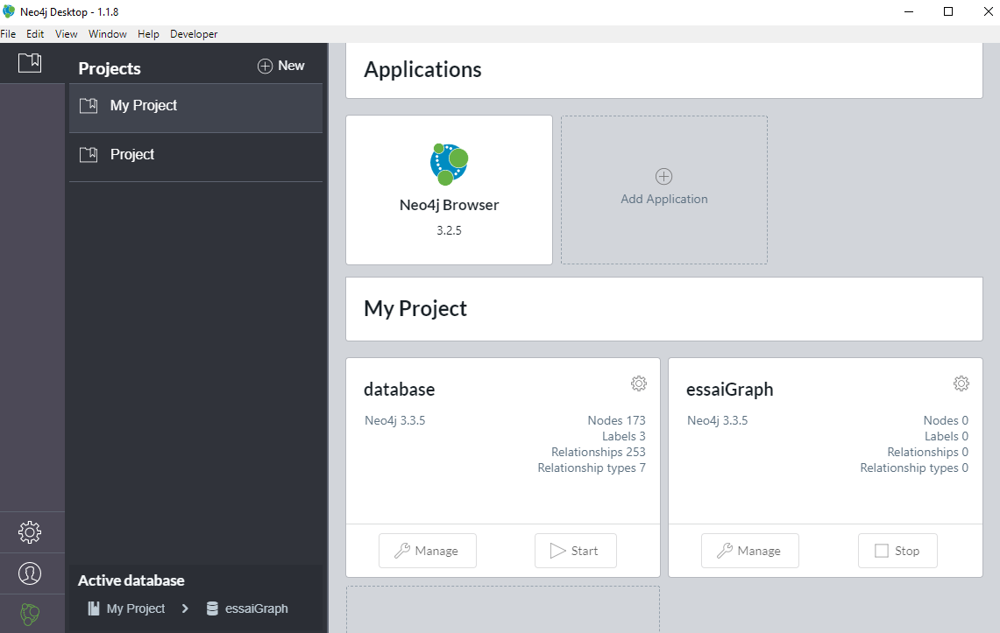

This paper brings to light how **network embedding graphs** can help to solve major open problems in natural language understanding. One illustrative element in NLP could be **language variability** - or **ambiguity problem** - which happens when two sentences express the same meaning (or ideas) with very different words. For instance we may say almost interchangeably: *<font color="blue">"where is the nearest sushi restaurant?"</font>* or *<font color="blue">"can you please give me addresses of sushi places nearby?"</font>*. These two sentences exactly share the same meaning with a different semantic wording. Here is the big challenge that we are struggling. In terms of data science, it bears witness of a well-known problem called **text similarity**. Indeed, my sparse vectors for the 2 sentences have no common words and consequently will have a cosine distance of 1. This is a terrible distance score because the 2 sentences have very similar meanings. 

The first thing that is crossing any data scientists'mind would have been to use popular **document embedding methods** based on **similarity measures** such as **Doc2Vec**, **Average w2v vectors**, **Weighted average w2v vectors** (e.g. tf-idf), **RNN-based embeddings (e.g. deep LSTM networks)**, ... to cope with this text similarity challenge. 

As for us, we will tackle this text similarity challenge by implementing **network graph embeddings** in light of **traditional word embeddings technics**. 

```{r, include=FALSE}
library(visNetwork)
library(kableExtra)
library(ggplot2)
library(dplyr)
library(tidytext)
library(janeaustenr)
library(igraph)
library(tidyr)
library(ggraph)
library(data.table)
```

# Word Embeddings

In very basic terms, word embeddings turns corpus text into numerical vectors. Consequently two different words - sharing in common a same semantic similarity - are close in term of Euclidean distance into a given high dimensional space. Words that have the same meaning have a similar representation - or a very close numerical vectors.

## Paradigmatic Similarity

We are born with the intention of implementing some Natural Language Processing (NLP) within Graph Databases and Neo4j. First, few words when it comes to Neo4j which is a graph database management system developed by Neo4j. The underlying concept is very simple: everything is stored in the form of either an **edge**, a **node**, or an **attribute**. Each node and edge can have any number of attributes. Both the nodes and edges can be **labelled**.

Let's consider two sentences: 

$S_{1}$ = Where is the nearest sushi restaurant?

$S_{2}$ = Can you please give me addresses of sushi places nearby?

- **Very basic transformation** : Remove stopwords such as "is", "the","can","you","please","me","of", ...

$S_{1}$ = {"Where","nearest","sushi","restaurant"}

$S_{2}$ = {"give","addresses","sushi","places","nearby"}

- **Each word is represented by its context**

left("sushi") = {"where","nearest","give","addresses"}

right("sushi") = {"restaurant","places","nearby"}

Here is the **Cypher Query** to put our two sentences into **neo4j graph database**:

```{}
WITH split(tolower("Where nearest sushi restaurant", "") AS text
UNWIND range(0, size(text)-2) AS i
MERGE (w1:Word {name: text[i]})
MERGE (w2: Word {name: text[i+1]})
MERGE (w1)-[:NEXT]-> (w2)
```

```{r, echo=FALSE}
nodes <- data.frame(id = c("Where","nearest","sushi","restaurant","give","addresses","places","nearby"), 
                    label = c("Where","nearest","sushi","restaurant","give","addresses","places","nearby"), 
                    group = c("S_1", "S_1", "S_2","S_1","S_3","S_3","S_3","S_3"))

edges <- data.frame(from = c("Where","nearest","sushi","give","addresses","sushi","places"),
                    to = c("nearest","sushi","restaurant","addresses","sushi","places","nearby"))

visNetwork(nodes, edges, main = "Representing text as a graph", height = "500px", width = "100%") %>% 
  visOptions(manipulation = TRUE) %>%
  visEdges(arrows = "to") %>% 
  visLayout(randomSeed = 123)
```

- Words with high context similarity likely have paradigmatic relation

Let's consider two news sentences: 

$S_{1}$ = My boss eats sushi on Friday

$S_{2}$ = My brother eats pizza on Sunday evening

```{}
Sim("boss","brother") = 
    Sim(left("boss"), right("boss")) + 
    Sim(left("brother"), right("brother"))
```

```{r, echo=FALSE}
nodes <- data.frame(id = c("boss","eats","sushi","Friday","brother","pizza","Sunday","evening"), 
                    label = c("boss","eats","sushi","Friday","brother","pizza","Sunday","evening"),
                    group = c("S_1", "S_2", "S_1","S_1","S_3","S_3","S_3","S_3"))

edges <- data.frame(from = c("boss","eats","sushi","brother","eats","pizza","Sunday"),
                    to = c("eats","sushi","Friday","eats","pizza","Sunday", "evening"))

visNetwork(nodes, edges, main = "Context similarity and Paradigmatic relationships", height = "500px", width = "100%") %>% 
  visOptions(manipulation = TRUE) %>%
  visEdges(arrows = "to") %>% 
  visLayout(randomSeed = 123)
```
  
# Network graph word embeddings

## Transform text corpus into graph

Let's consider https://newsapi.org/ which is a simple and easy-to-use API that returns JSON metadata for headlines and articles live all over the web right now. News API indexes articles from over 30,000 worldwide sources. 

```{r, echo=FALSE}
setwd("C:/Users/adsieg/Desktop/projet_perso/part_1")
news_data<-fread("news.csv", sep = ",", header= TRUE)

news_data$category<-as.factor(news_data$category)

kable(news_data[c(1:8),c(1:5)]) %>%
  kable_styling(bootstrap_options = "striped", full_width = F)
```

Let's switch **from** a linear and static **SQL** dataframe **to** a dynamic **NoSQL** database - i.e. from relational to non-relational database. 

As you can spot, there are 9 variables within our dataframe coming from newsAPI. The job is to transform individual column into a relational data model. Let's take an instance to make a good start.

- "author" variable is turning into **<font color="red">red pen logo</font>** inside our new NoSQL database

- "description" variable is turning into **<font color="orange">orange comments logo</font>** inside our new NoSQL database

- "publishedAt" variableis turning into **<font color="green">green clock logo</font>** inside our new NoSQL database

- "source" variable is turning into **<font color="yellow">yellow compass logo</font>** inside our new NoSQL database

- "category" variable is turning into **<font color="black">black compass logo</font>** inside our new NoSQL database

- "title" variable is turning into **<font color="blue">blue folder logo</font>** inside our new NoSQL database

```{r, echo=FALSE}
nodes <- data.frame(id = 1:6, group = c("A", "B", "C","D","E","F"))
edges <- data.frame(from = c(1,1,1,1,1), 
                    to = c(2,3,4,5,6))

visNetwork(nodes, edges, width = "100%") %>%
  visGroups(groupname = "A", shape = "icon", 
            icon = list(code = "f07c", size = 75)) %>% # folder
  visGroups(groupname = "B", shape = "icon", 
            icon = list(code = "f044", color = "red")) %>% # pen
  visGroups(groupname = "C", shape = "icon", 
            icon = list(code = "f14e", color = "yellow")) %>% # direction
  visGroups(groupname = "D", shape = "icon", 
            icon = list(code = "f086", color = "orange")) %>% # comments
  visGroups(groupname = "E", shape = "icon", 
            icon = list(code = "f017", color = "green")) %>% # clock
  visGroups(groupname = "F", shape = "icon", 
            icon = list(code = "f187", color = "black")) %>% # category
  addFontAwesome()
```

## Load data into Neo4j

It should not be forgotten that the neo4j graph **just below** is just an isolated implementation of a given piece of information. Now the time has come to repeat a command looping over each news. In order to industrialise the building processes of our neo4j database, we are going to implement it on https://neo4j.com/

This big step will be the main topic of paper 2 [put the link here file:///C:/Users/adsieg/Desktop/projet_perso/part_1/part_2.html]

To give a first hint of what is neo4j, here is home screen of my database in which all news will be stocked...

<center>

</center>

Just to provide some context of why we need to lead this step - let's consider a concrete example to highlight how important links are to retrieve quickly and efficiently information as well as bringing to light unseeable links which stand for within a static and linear database. 

```{r, echo=FALSE}
nodes <- data.frame(id = 1:15, group = c("A", "B", "C","D","E","F","A", "B", "C","D","F","A","D", "E", "F"))
edges <- data.frame(from = c(1,1,1,1,1,7,7,7,7,7,12,12,12,12,12), 
                    to = c(2,3,4,5,6,8,9,10,5,11,2,3,13,14,15))

visNetwork(nodes, edges, width = "100%") %>%
  visGroups(groupname = "A", shape = "icon", 
            icon = list(code = "f07c", size = 75)) %>% # folder
  visGroups(groupname = "B", shape = "icon", 
            icon = list(code = "f044", color = "red")) %>% # pen
  visGroups(groupname = "C", shape = "icon", 
            icon = list(code = "f14e", color = "yellow")) %>% # direction
  visGroups(groupname = "D", shape = "icon", 
            icon = list(code = "f086", color = "orange")) %>% # comments
  visGroups(groupname = "E", shape = "icon", 
            icon = list(code = "f017", color = "green")) %>% # clock
  visGroups(groupname = "F", shape = "icon", 
            icon = list(code = "f187", color = "black")) %>% # category
  addFontAwesome()
```

# Relationships between words

```{r,fig.width = 10, fig.height = 6}
ggplot(news_data, aes(x=category, fill=category)) +  geom_bar() + theme_bw()
```

## N-grams and correlations

### Category : General 

```{r}
general_news <- news_data %>% 
  filter(category == "general") %>% 
  select(description) 

general_news_bigrams <- general_news %>%
  unnest_tokens(bigram, description, token = "ngrams", n = 2) %>%
  as.data.frame()

general_news_bigrams_counts<- general_news_bigrams %>%
  count(bigram, sort = TRUE)

kable(general_news_bigrams_counts[c(1:10),]) %>%
  kable_styling(bootstrap_options = "striped", full_width = F)
```


As we can see there are a lot of StopWords such as - they bring no information and consequently 

```{r}
bigrams_separated <- general_news_bigrams %>%
  separate(bigram, c("word1", "word2"), sep = " ")

bigrams_filtered <- bigrams_separated %>%
  filter(!word1 %in% stop_words$word) %>%
  filter(!word2 %in% stop_words$word)

bigram_counts <- bigrams_filtered %>% 
  count(word1, word2, sort = TRUE)
```

```{r}
bigram_counts %>%
  filter(n >= 50) %>%
  graph_from_data_frame() %>%
  ggraph(layout = "fr") +
  geom_edge_link(aes(edge_alpha = n, edge_width = n), edge_colour = "cyan4") +
  geom_node_point(size = 5) +
  geom_node_text(aes(label = name), repel = TRUE, 
                 point.padding = unit(0.2, "lines")) +
  theme_void()
```


### Category : Sport

```{r, echo=FALSE}

sport_news <- news_data %>% 
  filter(category == "sport") %>% 
  select(description) 

sport_news_bigrams <- sport_news %>%
  unnest_tokens(bigram, description, token = "ngrams", n = 2) %>%
  as.data.frame()

bigrams_separated_sport <- sport_news_bigrams %>%
  separate(bigram, c("word1", "word2"), sep = " ")

bigrams_filtered_sport <- bigrams_separated_sport %>%
  filter(!word1 %in% stop_words$word) %>%
  filter(!word2 %in% stop_words$word)

bigram_counts_sport <- bigrams_filtered_sport %>% 
  count(word1, word2, sort = TRUE)

bigram_counts_sport %>%
  filter(n >= 50) %>%
  graph_from_data_frame() %>%
  ggraph(layout = "fr") +
  geom_edge_link(aes(edge_alpha = n, edge_width = n), edge_colour = "darkred") +
  geom_node_point(size = 5) +
  geom_node_text(aes(label = name), repel = TRUE, 
                 point.padding = unit(0.2, "lines")) +
  theme_void()

```

### Category : Business

```{r, echo=FALSE}

business_news <- news_data %>% 
  filter(category == "business") %>% 
  select(description) 

business_news_bigrams <- business_news %>%
  unnest_tokens(bigram, description, token = "ngrams", n = 2) %>%
  as.data.frame()

bigrams_separated_business <- business_news_bigrams %>%
  separate(bigram, c("word1", "word2"), sep = " ")

bigrams_filtered_business <- bigrams_separated_business %>%
  filter(!word1 %in% stop_words$word) %>%
  filter(!word2 %in% stop_words$word)

bigram_counts_business <- bigrams_filtered_business %>% 
  count(word1, word2, sort = TRUE)

bigram_counts_business %>%
  filter(n >= 50) %>%
  graph_from_data_frame() %>%
  ggraph(layout = "fr") +
  geom_edge_link(aes(edge_alpha = n, edge_width = n), edge_colour = "royalblue") +
  geom_node_point(size = 5) +
  geom_node_text(aes(label = name), repel = TRUE, 
                 point.padding = unit(0.2, "lines")) +
  theme_void()

```


## Are there the same words in keeping with categories? 
